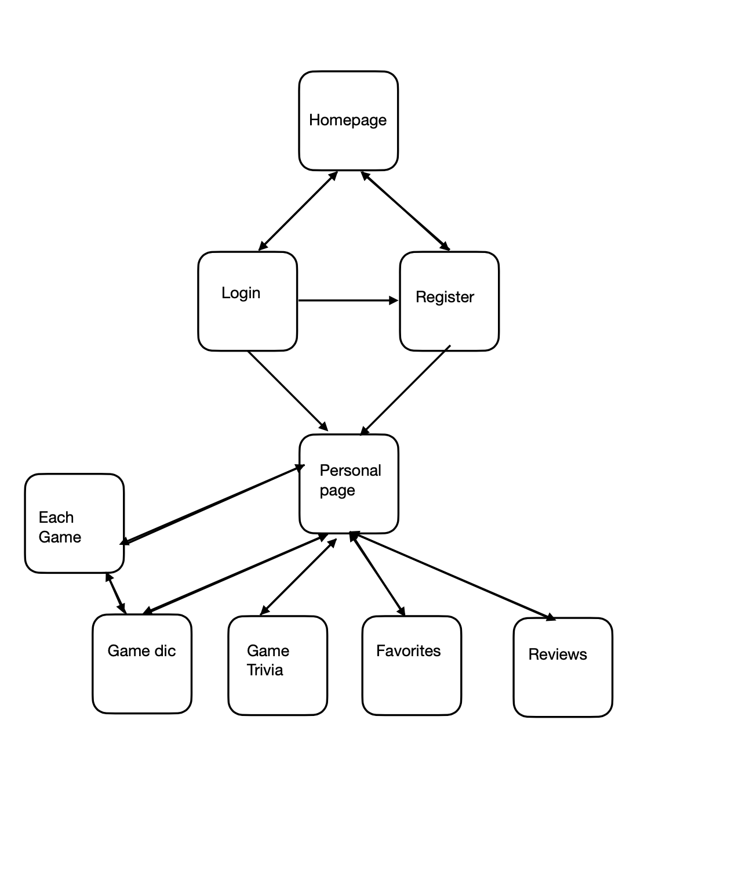

The content below is an example project proposal / requirements document. Replace the text below the lines marked "__TODO__" with details specific to your project. Remove the "TODO" lines.


# Game Dictionary

## Overview

This project is aimed to create a platform for gamers to search for the information of games.

In the web, the users can search for information on the game. They can also create account, view games in the dictionary and check them. They can also set their favorates game and write reviews. They can also play game trivia that randomly generated from all the dictionary.

## Data Model

The application will store Users, Games, Reviews(Maybe Images).

* Users can have their lovegames and reviews (via references)
* each game
* each review
* each image

(__TODO__: sample documents_)

An Example User:

```javascript
{
  username: // username
  hash: // a password hash,
  lovegame: collection of Game// place their favorate games
  reviews: collection of Review// place their reviews
  state: // to judge whether it wanted to check by other users
}
```

An Example Game:

```javascript
{
  name: // game name
  year: // the publish year,
  platform: // the platform on issue
  review: collection of Review // all the review objects
  website: // their official website
}
```

An Example Review:

```javascript
{
  user: // the user 
  date: // the time of the review,
  game: // the name of the game on the review
  contents: // the review text
  states: // whether the review is send public
}
```

If possible another schema Image:
```javascript
{
  game: // the game of the image
  image: // the store of image,
}
```

## [Link to Commented First Draft Schema](db.js) 


## Wireframes

/ - the page for the home


/login - the page for the logging in


/register - the page for signUp


/personal-page - the page for all the possible things after log-in


/personal-page/favorates - An ajax that shows on personal-page but referred in favorates checking my favorates games


/personal-page/reviews - An ajax that shows on personal-page but referred in favorates checking my reviews


/gamedic - checking game dicitonary


/gameTrivia - play the game Trivia


/:gameName - each game in the dictionary has their own webpage that user can check, add review and choose favorates


## Site map


Here's a [complex example from wikipedia](https://upload.wikimedia.org/wikipedia/commons/2/20/Sitemap_google.jpg), but you can create one without the screenshots, drop shadows, etc. ... just names of pages and where they flow to.


## User Stories or Use Cases

1. as non-registered user, I can register a new account with the site
2. as a user, I can log in to the site
3. as a user, I can check and search game on the game dictionary
4. as a user, I can write review for specific games
5. as a user, I can click to see each game.
6. as a user, I can choose whether to like the game
7. as a user, I can play the game trivia

## Research Topics

* (3 points) Using heroku + mongodb atlas
  * I am going to use heroku to build my application to let it last longer
  * I will use mongodb atlas to store data
  * https://devcenter.heroku.com/articles/deploying-nodejs#provision-a-database
  * https://www.youtube.com/watch?v=OuCrHynro0w


* (1 points) Hash
  * I'm going to use bcrypt to hash the password to make the log-in safer
  * https://www.npmjs.com/package/bcrypt

* (1 points) Using partials in hbs
  * Using partials in hbs to make some common parts in an HTML
  * https://handlebarsjs.com/guide/partials.html#basic-partials

* (5) Authentication
  * I am going to use passport to make help with the authentication process
  * passport
  * https://www.passportjs.org/concepts/authentication/middleware/
  * https://www.youtube.com/watch?v=F-sFp_AvHc8

10 points total out of 8 required points (___TODO__: addtional points will __not__ count for extra credit_)


## [Link to Initial Main Project File](app.js) 

## Annotations / References Used

1. [heroku](https://devcenter.heroku.com/articles/deploying-nodejs#provision-a-database) - (evidence in the URL)
2. [Passport](https://www.passportjs.org/concepts/authentication/middleware/) - (add link to source code that was based on this) - (https://github.com/nyu-csci-ua-0467-001-002-spring-2022/final-project-Drafee/blob/master/auth.js)
3. [mongodb atlas](https://www.youtube.com/watch?v=OuCrHynro0w) - (https://github.com/nyu-csci-ua-0467-001-002-spring-2022/final-project-Drafee/blob/master/db.js)
4. [bcrypt](https://www.npmjs.com/package/bcrypt) - (https://github.com/nyu-csci-ua-0467-001-002-spring-2022/final-project-Drafee/blob/1aee2fcdc834f9d01e06eea4645ad40ac86637fe/auth.js#L16)
5. [font](https://www.1001fonts.com/video-game-fonts.html?page=5) - (https://github.com/nyu-csci-ua-0467-001-002-spring-2022/final-project-Drafee/blob/master/public/stylesheets/never.ttf)


